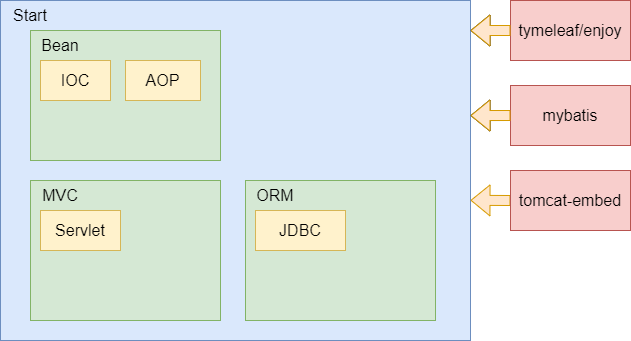

<h1 align="center">Harbour-framework</h1>
<p align="center">基于<code>Java8</code>创造的轻量级、简洁优雅的Web框架 </p>
<p align="center">您可以在 <b>短时间</b> 学会它做点有趣的项目</p>
<p align="center">
    <a href="index.html#/README?id=开始" target="_self">快速开始</a> | 
    <a href="https://huanyv.github.io/harbour" target="_blank">官方文档</a> | 
    <a href="https://github.com/huanyv/harbour-framework" target="_blank">支持我</a> 
</p>

## 开始

`Harbour` 是一个追求简约、轻量的 Web 框架，集IOC、AOP、MVC、ORM于一体，让 `JavaWeb` 开发更加轻松，在轻量与灵活性上同时兼顾。 在使用方式上提供与SpringBoot基本相同的注解和设计理念，学习转换几乎零成本 。
如果觉得这个项目不错可以 [star](https://github.com/huanyv/harbour-framework) 支持



* 简洁的：框架设计简单,容易理解,不依赖于更多第三方库。
* 优雅的：`Harbour` 支持 REST 风格路由接口, 提供lambda函数路由。
* 易部署：支持 `maven` 打成 `jar` 包直接运行

## 功能特性

* 轻量级MVC框架，不依赖更多的库
* 简约ORM框架，轻松操作数据库
* 模块化设计，各个模块之间可独立使用
* 源码轻量，学习简单
* Restful风格路由设计
* 模板引擎支持，视图开发更灵活
* 运行 `JAR` 包即可开启 web 服务
* lambda流式API风格
* 支持webjars静态资源与本地资源映射
* 内置多种常用功能
* Jdk8 + Servlet4

## 快速上手

### HelloWorld

1. 安装依赖

* 执行`install.bat`脚本，双击即可，等待全部success
* 创建一个Maven项目，添加依赖

```xml
<dependency>
    <groupId>top.huanyv</groupId>
    <artifactId>harbour-start-web</artifactId>
    <version>1.0</version>
</dependency>
```

2. 创建一个类，编写一个Main函数（启动类）

```java
public class MainApplication {
    public static void main(String[] args) {
        Harbour.use().get("/hello", (req, resp)-> resp.html("<h1>Hello World!</h1>")).run(MainApplication.class);
    }
}
```
* 系统以2333做为默认端口号，没有context path，访问<http://localhost:2333/hello>
* 如果你使用过SpringBoot的话，它与其使用方式是相同的
* **所有的包与类都应在启动类所在的包下**，如下所示：

```
src
    main
        java
            > org.example
                > controller
                    HelloContrller.java
                > service
                > dao
                > config
                MainApplication.java
        resources
    test
        java
        resources
```

### 依赖管理

* 你可以使用`harbour-parent`做为父项目，管理依赖，当你使用其它的harbour依赖项时，你可以不必写版本号

```xml
<parent>
    <groupId>top.huanyv</groupId>
    <artifactId>harbour-parent</artifactId>
    <version>1.0</version>
    <relativePath /> <!-- lookup parent from repository -->
</parent>

<dependencies>
    <dependency>
        <groupId>top.huanyv</groupId>
        <artifactId>harbour-start-web</artifactId>
    </dependency>
</dependencies>
```

### 组件托管

* 组件就是一个类，声明一个组件非常简单，在类上使用`@Bean`注解即可
* 当在其它的类中依赖到此类时，直接使用`@Inject`就可以自动注入属性，不需要手动`new`
* 组件被扫描到的前提是：**组件必需在启动类包或子包下**

```java
@Bean
public class UserServiceImpl implements UserService {

	// .....

}

// 要想自动注入，此类也要是一个组件
@Bean
public class UserController {

    // 不需要这样
    // private UserService userService = new UserServiceImpl();

    @Inject // 类型注入
    private UserService userService;

    // .....
}
```

### 分层路由

* 你大可不必把所有的请求路由都像上面一样，集中写在main方法中，因为这样写极不方便管理
* 可以使用实现`RouteRegistry`接口的方式
* **此类需要是一个组件**

```java
@Bean
public class UserController implements RouteRegistry {
    @Override
    public void run(Routing app) {
        app.get("/user/get", (req, resp) -> resp.html("获取用户"))
                .post("/user/add", (req, resp)->resp.html("添加用户"))
                .post("/user/update", (req, resp)->resp.html("修改用户"))
                .post("/user/del", (req, resp)->resp.html("删除用户"));
    }
}
```

### 配置文件

* 在`resources`下创建名为`application.properties`的文件
* 那么这个文件中应该写什么呢？
    * 你要的配置应该是`ApplicationLoader`接口实现类，对应的属性
    * 由`@Properties`注解的`prefix`属性值+属性名为配置项
    * 比如下面这个类，这个是内嵌`Tomcat`的自动加载类

```java
@Properties(prefix = "server.")
public class TomcatStartLoader implements ApplicationLoader {

    private long maxFileSize = 1048576;

    private long maxRequestSize = 10485760;

    private int port = 2333;

    private String contextPath = "";

    private String uriEncoding = StandardCharsets.UTF_8.name();

    // ........
}
```

```properties
# 配置端口号
server.port=8081
# 配置servlet context path
server.contextPath=/test
# 配置最大上传文件限制
server.maxFileSize=10240000L
```

### 打包部署

* 由于使用的内嵌Tomcat，打成`jar`包即可

1. 引入以下插件依赖

```xml
<build>
    <plugins>
        <plugin>
            <groupId>org.apache.maven.plugins</groupId>
            <artifactId>maven-shade-plugin</artifactId>
        </plugin>
    </plugins>
</build>
```

2. 指定启动类

```xml
<properties>
    <main.class>com.book.MainApplication</main.class>
</properties>
```

* 执行`package`后，使用`java -jar xxx.jar`启动运行


### 更多功能请看<a href="https://huanyv.github.io/harbour" target="_self">详细文档</a>


